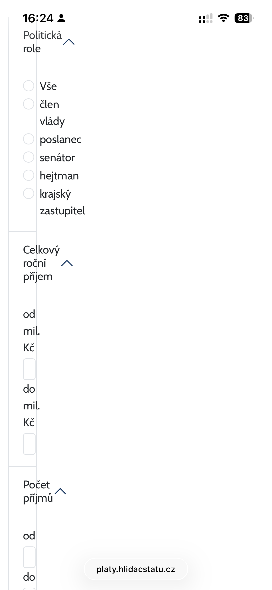

# Hlidac Statu

Site link: [hlidacstatu.cz](http://hlidacstatu.cz)

Reported / Fixed
- [ ] [Salary boxes are unreadable / broken](#salary-boxes-are-unreadable--broken)
- [ ] [Filter for salary list is broken](#filter-for-salary-list-is-broken)
- [ ] [Institutions in the field is overlapping page width](#institutions-in-the-field-is-overlapping-page-width)
- [ ] [Search button overlapping in header](#search-button-overlapping-in-header)
- [ ] [Homepage video out of box](#homepage-video-out-of-box)
- [ ] [Logos overlapping texts](#logos-overlapping-texts)

## Bugs

### Salary boxes are unreadable / broken

**Url:** https://platy.hlidacstatu.cz/politici \
**Device:** iPhone 13 / Safari

Salary boxes are squished and hard to read. 
When I was checking this page on mobile, it has nice one box per line style 
until 576px. Then it starts applying CSS rule `width: 33.33333333%;`

### Filter for salary list is broken

**Url:** https://platy.hlidacstatu.cz/politici/seznam?politicianGroups=poslanec \
**Device:** iPhone 13 / Safari

Percentage width for the first column is messing with the styles.

### Institutions in the field is overlapping page width

**Url:** https://platy.hlidacstatu.cz/Urednici/oblast/bezpecnost \
**Device:** iPhone 13 / Safari

Table is overlapping the page width. Maybe scrollable by X axis would help.

### Search button overlapping in header

**Url:** https://texty.hlidacstatu.cz/kontakt/ / https://texty.hlidacstatu.cz/kodex/ \
**Device:** iPhone 13 / Safari

Multiple pages have overlapping search button in header.

### Homepage video out of box

**Url:** https://www.hlidacstatu.cz/ \
**Device:** iPhone 13 / Safari

Youtube video on homepage is out of the box on mobile devices.

### Logos overlapping texts

**Url:** https://texty.hlidacstatu.cz/pro-media/ \
**Device:** iPhone 13 / Safari

Images are overlapping texts in multiple places. Maybe you can put the image to separate row
so it has full width for display.

