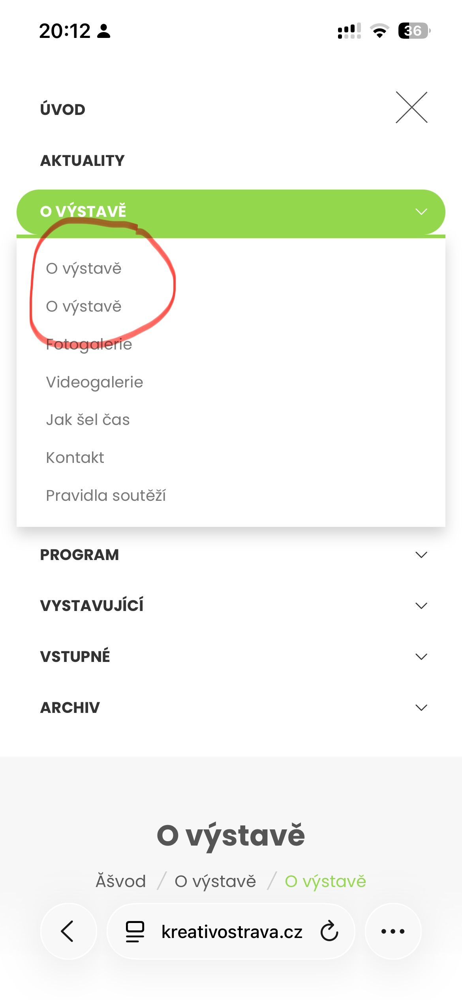
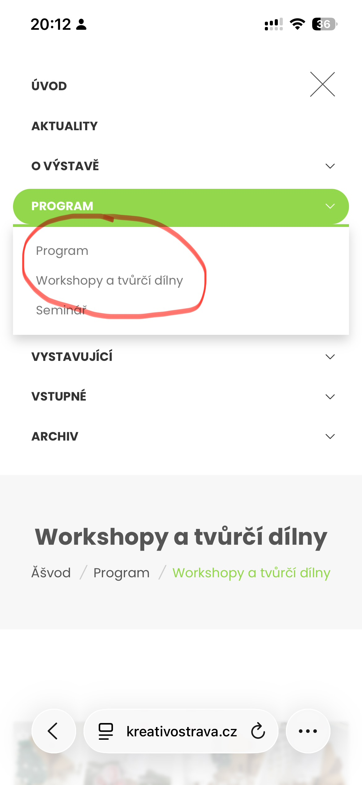
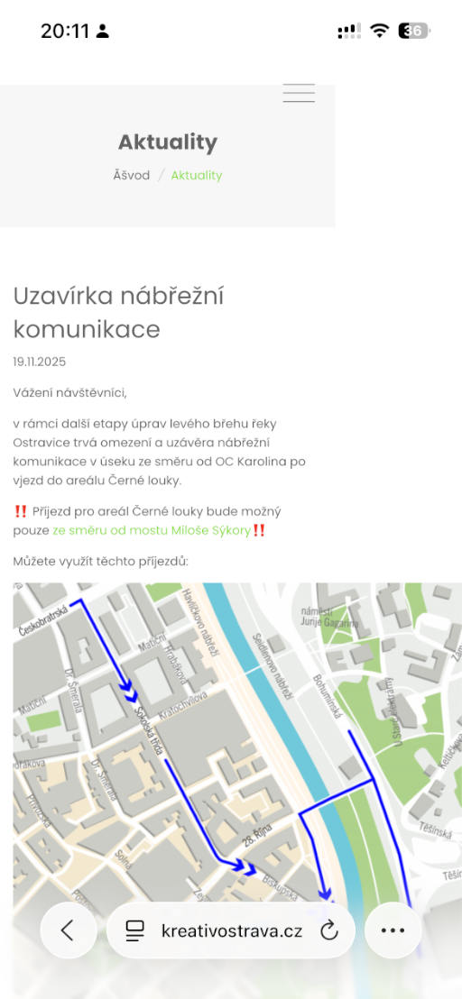

# Kreativ Ostrava

Site link: [kreativostrava.cz](http://kreativostrava.cz)

Reported / Fixed
- [ ] [Broken text in breadcrumbs](#bugs-broken-text-in-breadcrumbs)
- [ ] [Duplicate menu items in mobile menu](#bugs-duplicate-menu-items-in-mobile-menu)
- [ ] [Map overflowing on mobile](#bugs-map-overflowing-on-mobile)

## Bugs

### Broken text in breadcrumbs

**Url:** any url with breadcrumbs\
**Device:** mobile and desktop

Instead of "Úvod" it shows "Úvod". This looks like a character encoding issue.

### Duplicate menu items in mobile menu

**Url:** any url\
**Device:** iPhone 13 / Safari

When opening the mobile menu section "O výstavě" I can see duplicate menu items that have the same name and lead to the same page.

Similar for the section "Program", there are two menu items "Program" and "Workshopy a tvurci dilny" that lead to the same page https://www.kreativostrava.cz/cz/program/workshopy-a-tvurci-dilny/.

### Map overflowing on mobile

**Url:** https://www.kreativostrava.cz/cz/aktuality/143-uzavirka-nabrezni-komunikace.html\
**Device:** iPhone 13 / Safari

The image of map on this page overflows the screen on mobile devices, causing horizontal scrolling.

